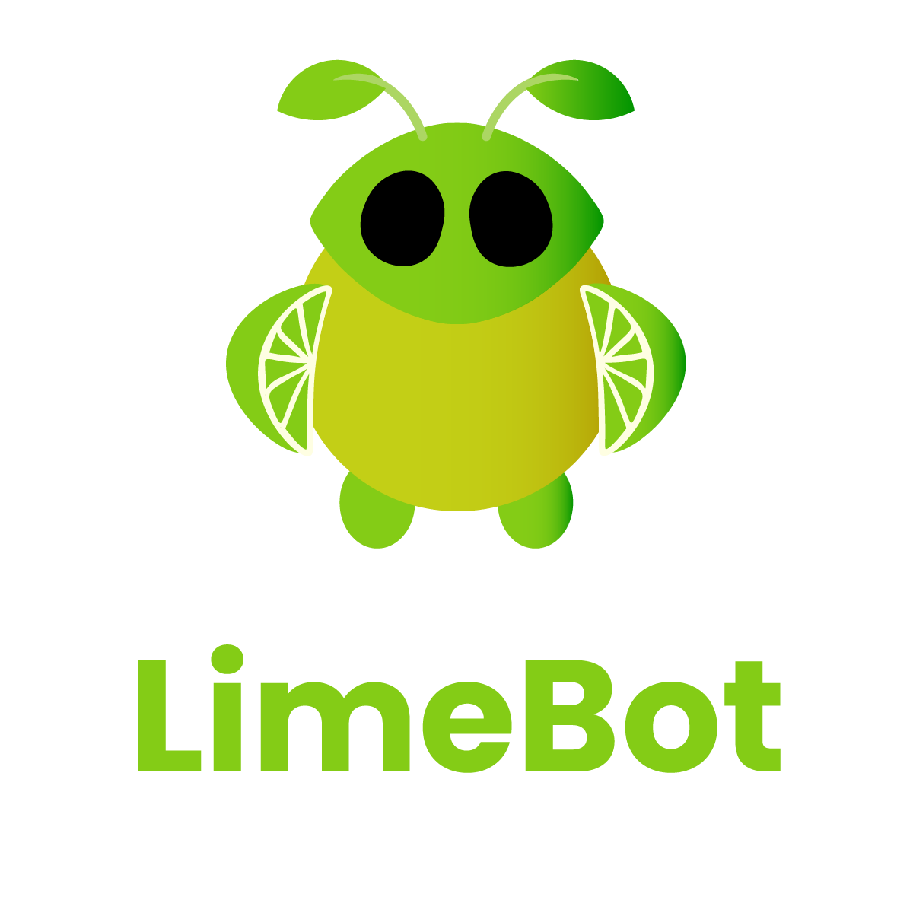

<div align="center">
  
</div>

# 🍋 LimeBot


> A persistent, self-evolving agentic AI that lives across your devices — with a soul, a memory, and a personality that's actually yours. Inspired by the powerful [OpenClaw](https://github.com/openclaw/openclaw) and the lightweight architecture of [Nanobot](https://github.com/HKUDS/nanobot).


[](https://opensource.org/licenses/MIT)
[](https://www.python.org/)
[](https://github.com/BerriAI/litellm)
[](#-privacy--security)

LimeBot is not a wrapper around an API. It's a full agentic system — event-driven, multi-channel, and built to remember who you are. It browses the web, manages your files, schedules reminders, spawns sub-agents for complex tasks, and evolves its personality through every conversation. All of it runs on your hardware.

---

## ✨ What It Can Actually Do

### 🧠 It Remembers Everything
Three-tier memory system that persists across sessions:
- **Episodic Memory** — every conversation is appended to a daily markdown journal (`persona/memory/YYYY-MM-DD.md`)
- **Semantic Memory** — entries are embedded and stored in a local LanceDB vector database, enabling fuzzy recall of anything said weeks ago
- **Auto-RAG** — before every reply, LimeBot automatically searches its memory (semantically first, grep fallback) and injects relevant context into the prompt without you asking
- **Reflection Engine** — a background cron job runs every 4 hours, reads today's journal, and distills the key facts into a permanent `MEMORY.md` long-term essence file

### 👤 It Has a Real Persona
Not a hardcoded system prompt. A living identity that evolves:
- **`SOUL.md`** — core values, personality, and behavioral boundaries
- **`IDENTITY.md`** — name, emoji, avatar URL, style, catchphrases, interests, birthday
- **Per-platform styles** — separate voice for Discord, WhatsApp, and Web
- **Per-user profiles** — builds a relationship profile for each person it talks to, tracking affinity scores, relationship level, in-jokes, and milestones
- **Dynamic Mood** — optional `MOOD.md` that shifts based on conversations and persists between sessions
- **Setup Interview** — on first boot with no persona defined, the bot interviews you to build its identity from scratch. It saves the result automatically once it has enough to work with.

### 🌐 It Browses the Web
Full Playwright-powered browser automation:
- Navigate to any URL, click elements, fill forms, scroll pages
- `google_search()` shortcut for quick lookups
- Extract page text, take DOM snapshots, list all media on a page
- Download high-resolution images from Pinterest, Reddit, Wikimedia, direct URLs
- Results stream back in real time with progress updates in the dashboard

### 📁 It Has Access to Your Files
Whitelisted filesystem operations:
- Read, write, create, delete, move, rename files and directories
- All operations sandboxed to `ALLOWED_PATHS` — nothing outside those roots is touchable unless you explicitly allow it
- Dangerous operations (write, delete, run) require explicit confirmation through the web UI before executing

### ⚙️ It Can Run Commands
Secure subprocess execution with real-time output streaming:
- Runs shell commands inside the project root
- Shell injection filter blocks `;`, `&&`, `|`, backticks, `$()`, and env manipulation
- **Stall detection** — if a command produces no output for 30 seconds (likely waiting for interactive input), it's automatically terminated with guidance to retry using non-interactive flags
- Requires user confirmation via the dashboard before any command executes
- **Autonomous Mode** — optionally bypass all confirmation prompts for full hands-off operation
- **Session-based approval** — approve a tool once for the current session without enabling full autonomy

### 🕐 It Schedules Its Own Reminders
Persistent cron system:
- One-time reminders: `"remind me in 2 hours to call mom"`
- Repeating jobs: full cron expression support (`0 8 * * *`)
- Jobs survive restarts (persisted to `data/cron.json`)
- With Dynamic Personality enabled: automatic morning greetings and silence check-ins

### 🤖 It Can Spawn Sub-Agents
For complex multi-step tasks, LimeBot can delegate work to an isolated background agent:
- Sub-agent runs in its own session with its own tool loop
- Reports back to the parent session when complete
- Useful for long-running research, file processing, or anything that shouldn't block the main conversation

---

## 📡 Channels

| Channel | How it works |
|---------|-------------|
| **Web Dashboard** | React + Vite UI connecting over WebSocket. Streams tokens as they arrive, shows live tool execution cards, confirmation prompts, thinking traces, and ghost activity indicators for background memory operations. |
| **Discord** | Full `discord.py` integration. Responds to DMs and `@mentions`. Configurable allow-list by user ID and channel ID. Custom presence status, activity type, and display name. |
| **WhatsApp** | Connects to a local `whatsapp-web.js` bridge over WebSocket. Contact approval whitelist with pending/blocked states. QR code displayed in the web dashboard for easy pairing. |

---

## 🤖 LLM Support

LimeBot uses [LiteLLM](https://github.com/BerriAI/litellm) — any model it supports, LimeBot supports:

| Provider | Example model string |
|----------|---------------------|
| **Gemini** (default) | `gemini/gemini-2.0-flash` |
| **OpenAI** | `openai/gpt-4o` |
| **Anthropic** | `anthropic/claude-3-5-sonnet-20241022` |
| **xAI** | `xai/grok-2` |
| **DeepSeek** | `deepseek/deepseek-chat` |
| **Mistral** | `mistral/mistral-large-latest` |
| **NVIDIA NIM** | `nvidia/meta/llama-3.1-405b-instruct` |
| **Ollama (local)** | `ollama/llama3.2` + `LLM_BASE_URL=http://localhost:11434` |

Switch models live from the web dashboard without restarting.

---

## 🧩 Skills

Skills extend what LimeBot can do. Each skill is a folder with a `SKILL.md` (the LLM instructions) and a `skill.py` or script (the execution logic).

**Built-in skills:**

| Skill | What it does |
|-------|-------------|
| `browser` | Full Playwright web browsing — navigate, click, type, search, extract |
| `download_image` | Download high-res images from Pinterest, Reddit, Wikimedia, or direct URLs |
| `filesystem` | Extended file operations beyond the core toolbox |
| `discord` | Send messages and embeds to any Discord channel by ID |
| `discord-voice` | ElevenLabs TTS voice bot for Discord with slash commands and voice cloning |
| `whatsapp` | Send files and media to WhatsApp conversations |
| `docx-creator` | Generate formatted Microsoft Word `.docx` documents |

**ClawHub Skills:**

LimeBot supports installing skills from the [ClawHub](https://github.com/openclaw/clawhub) registry. These are community-built tools that LimeBot can call as `clawhub_<skill_name>`.

| Skill | What it does |
|-------|-------------|
| `clawhub_weather` | Get current weather and forecasts for any location (no API key required) |

**Install a ClawHub skill:**
```bash
npx clawhub install <skill-name> --workdir ./skills/clawhub --dir installed
```

Installed skills appear in `skills/clawhub/installed/` and are automatically available as tools. Enable or disable them from the **Skills** tab in the web dashboard.

**Install community skills from GitHub:**
```bash
# Full URL
python -m core.skill_installer install https://github.com/user/my-lime-skill

# GitHub shorthand
python -m core.skill_installer install user/my-lime-skill

# Or via the CLI wrapper
npm run lime-bot skill install https://github.com/user/my-lime-skill
```

The installer auto-detects the repo's default branch, and automatically runs `pip install` or `npm install` if dependency files are present.

**Other skill commands:**
```bash
python -m core.skill_installer list
python -m core.skill_installer update <skill_name>
python -m core.skill_installer uninstall <skill_name>
python -m core.skill_installer enable <skill_name>
python -m core.skill_installer disable <skill_name>
```

Skills can also be managed from the **Skills** tab in the web dashboard.

---

## 🚀 Getting Started

### Prerequisites
- Python 3.11+
- Node.js 18+
- A Gemini API key (or any LiteLLM-compatible key)

### Quick Start
```bash
git clone https://github.com/LemonMantis5571/LimeBot.git
cd LimeBot
npm run lime-bot start
```

The CLI handles everything on first run: creates a Python venv, installs backend + frontend dependencies, and opens the web UI. On first chat, LimeBot will interview you to build its persona.

### Manual Start (Developers)
```bash
# Terminal 1 — Backend
cp .env.example .env   # fill in your keys
pip install -r requirements.txt
python main.py

# Terminal 2 — Frontend
cd web && npm install && npm run dev
```

### Docker
```bash
docker-compose up --build
```

---

## ⚙️ Configuration

Copy `.env.example` to `.env`:

```env
# Core
LLM_MODEL=gemini/gemini-2.0-flash
GEMINI_API_KEY=your_key_here

# Channels (all optional)
DISCORD_TOKEN=your_discord_bot_token
ENABLE_WHATSAPP=false

# Security
ALLOWED_PATHS=./persona,./logs,./temp
APP_API_KEY=optional_dashboard_password

# Features
ENABLE_DYNAMIC_PERSONALITY=false   # per-user affinity, mood tracking, proactive greetings
```

Everything can also be changed live from the **Config** tab in the web dashboard — changes write `.env` and trigger a clean restart.

---

## 🛡️ Privacy & Security

- **Local-first** — all conversations, memories, and personal data stay on your machine.
- **Sandboxed Filesystem** — LimeBot can only read/write files in directories you explicitly whitelist.
- **Human-in-the-loop** — sensitive actions (running code, deleting files) require your confirmation.
- **Open Source** — audit the code yourself. No hidden telemetry.

---

## 🤝 Contributing

We love contributions! Please check out [CONTRIBUTING.md](CONTRIBUTING.md) for guidelines on how to submit PRs, report bugs, or request features.

---

## 📄 License

MIT © [LemonMantis5571](https://github.com/LemonMantis5571)
