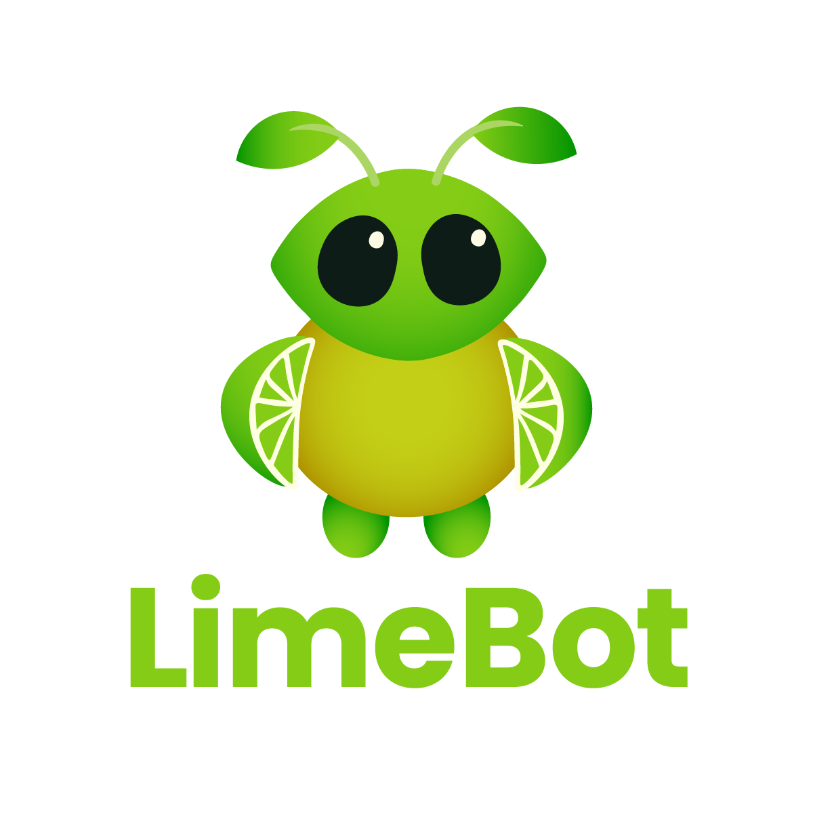
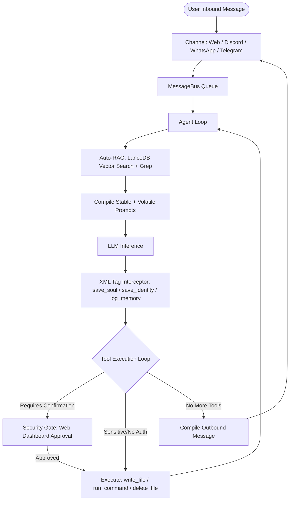

<div align="center">
  
</div>

# 🍋 LimeBot


> A persistent, self-evolving agentic AI that lives across your devices  with a soul, a memory, and a personality that's actually yours. Inspired by the powerful [OpenClaw](https://github.com/openclaw/openclaw) and the lightweight architecture of [Nanobot](https://github.com/HKUDS/nanobot).


[](https://opensource.org/licenses/MIT)
[](#-getting-started)
[](#-llm-support)
[](https://www.python.org/)
[](https://github.com/BerriAI/litellm)
[](#-privacy--security)

LimeBot is not a wrapper around an API. It's a full agentic system  event-driven, multi-channel, and built to remember who you are. It browses the web, manages your files, schedules reminders, spawns sub-agents for complex tasks, and evolves its personality through every conversation. All of it runs on your hardware.

---

## 🏛️ How It Works (Architecture Overview)

LimeBot operates on an **event-driven agentic loop**. When you send a message, it flows through the system as follows:


```mermaid
graph TD
    User([User Inbound Message]) --> Channel[Channel: Web / Discord / WhatsApp / Telegram]
    Channel --> Queue[MessageBus Queue]
    Queue --> Loop[Agent Loop]
    Loop --> RAG[Auto-RAG: LanceDB Vector Search + Grep]
    RAG --> SystemPrompt[Compile Stable + Volatile Prompts]
    SystemPrompt --> LLM[LLM Inference]
    LLM --> XML[XML Tag Interceptor: save_soul / save_identity / log_memory]
    XML --> Tools{Tool Execution Loop}
    Tools -- Requires Confirmation --> Auth[Security Gate: Web Dashboard Approval]
    Auth -- Approved --> Exec[Execute: write_file / run_command / delete_file]
    Tools -- Sensitive/No Auth --> Exec
    Exec --> Loop
    Tools -- No More Tools --> Reply[Compile Outbound Message]
    Reply --> Channel
```

---

## ✨ What It Can Actually Do

### 🧠 It Remembers Everything
Three-tier memory system that persists across sessions:
- **Episodic Memory**  every conversation is appended to a daily markdown journal (`persona/memory/YYYY-MM-DD.md`)
- **Semantic Memory**  entries are embedded and stored in a local LanceDB vector database, enabling fuzzy recall of anything said weeks ago
- **Auto-RAG**  before every reply, LimeBot automatically searches its memory (semantically first, grep fallback) and injects relevant context into the prompt without you asking
- **Reflection Engine**  a background cron job runs every 4 hours, reads today's journal, and distills the key facts into a permanent `MEMORY.md` long-term essence file

### 👤 It Has a Real Persona
Not a hardcoded system prompt. A living identity that evolves:
- **`SOUL.md`**  core values, personality, and behavioral boundaries
- **`IDENTITY.md`**  name, emoji, avatar URL, style, catchphrases, interests, birthday
- **Local-first persona files**  first boot auto-creates starter `SOUL.md`, `IDENTITY.md`, and `MEMORY.md` from shipped `.example` templates so users get a clean bot without committing live persona state
- **Per-platform styles**  separate voice for Discord, WhatsApp, and Web
- **Per-user profiles**  builds a relationship profile for each person it talks to, tracking affinity scores, relationship level, in-jokes, and milestones
- **Dynamic Mood**  optional `MOOD.md` that shifts based on conversations and persists between sessions
- **Setup Interview**  if the local persona files are missing or invalid, the bot interviews you to rebuild its identity and saves the result automatically once it has enough to work with.

### 🌐 It Browses the Web
Full Playwright-powered browser automation:
- Navigate to any URL, click elements, fill forms, scroll pages
- `google_search()` shortcut for quick lookups
- Extract page text, take DOM snapshots, list all media on a page
- Download high-resolution images from Pinterest, Reddit, Wikimedia, direct URLs
- Results stream back in real time with progress updates in the dashboard

### 📁 It Has Access to Your Files
Whitelisted filesystem operations:
- Read, write, create, delete, move, rename files and directories
- All operations sandboxed to `ALLOWED_PATHS`  nothing outside those roots is touchable unless you explicitly allow it
- Dangerous operations (write, delete, run) require explicit confirmation through the web UI before executing

### ⚙️ It Can Run Commands
Secure subprocess execution with real-time output streaming:
- Runs shell commands inside the project root
- Shell injection filter blocks `;`, `&&`, `|`, backticks, `$()`, and env manipulation
- **Stall detection**  if a command produces no output for 30 seconds (likely waiting for interactive input), it's automatically terminated with guidance to retry using non-interactive flags
- Requires user confirmation via the dashboard before any command executes
- **Autonomous Mode**  optionally bypass all confirmation prompts for full hands-off operation
- **Session-based approval**  approve a tool once for the current session without enabling full autonomy

### 🕐 It Schedules Its Own Reminders
Persistent cron system:
- One-time reminders: `"remind me in 2 hours to call mom"`
- Repeating jobs: full cron expression support (`0 8 * * *`)
- Jobs survive restarts (persisted to `data/cron.json`)
- With Dynamic Personality enabled: automatic morning greetings and silence check-ins

### 🤖 It Can Spawn Sub-Agents
For complex multi-step tasks, LimeBot can delegate work to an isolated background agent:
- Sub-agent runs in its own session with its own tool loop
- Built-in specialist profiles like `reviewer`, `verifier`, and `explorer` can be recommended automatically when the request wording matches the task
- Custom subagents can also be suggested when their descriptions overlap strongly with the current request
- Reports back to the parent session when complete
- The web chat renders delegated results as a dedicated sub-agent report card instead of raw trace text
- Useful for long-running research, file processing, or anything that shouldn't block the main conversation

LimeBot also exposes an authenticated local companion API at `/api/app/*` for inspecting durable workspaces, steering a workspace with messages, resolving approvals, and streaming normalized workspace events. It remains local-first and does not expose direct shell execution, credentials, artifact paths, or file-reading endpoints.

For CI review, `limebot review-diff --diff-file change.patch --output review.json` creates a capped, secret-redacted artifact. `.github/workflows/limebot-review.yml` is artifact-only with `contents: read`; model invocation is opt-in and it never posts PR comments, edits files, or pushes commits.

### 🔌 Model Context Protocol (MCP) Support
LimeBot is a fully-featured MCP client:
- **Universal Tool Integration**  connect to any MCP server (Fetch, Filesystem, Brave Search, etc.) to immediately expand the bot's capabilities.
- **Dynamic Discovery**  tools from connected MCP servers are automatically prefixed with `mcp_server_name_` and injected into the AI's tool registry.
- **Configurable Servers**  manage server arguments and environment variables directly from the web dashboard.
- **Safety & Resilience**  built-in timeouts and error handling ensure that misbehaving MCP servers don't hang the main agent loop.

---

## 📡 Channels

| Channel | How it works |
|---------|-------------|
| **Web Dashboard** | React + Vite UI connecting over WebSocket. Streams tokens as they arrive, shows live tool execution cards, confirmation prompts, thinking traces, and ghost activity indicators. **Includes a Custom CSS editor for global UI personalization.** |
| **Discord** | Full `discord.py` integration. Responds to DMs and `@mentions`. Configurable allow-list by user ID and channel ID. Custom presence status, activity type, and display name. |
| **WhatsApp** | Connects to a local `whatsapp-web.js` bridge over WebSocket. Contact approval whitelist with pending/blocked states. QR code displayed in the web dashboard for easy pairing. |
| **Telegram** | Bot API long-polling scaffold. Supports text send/receive, per-user allow-listing, optional per-chat allow-listing, and startup wiring for future expansion. |

### 🧩 Browser Companion Extension

LimeBot also ships with a browser companion extension for Chrome, Edge, and Opera GX.

- Ask LimeBot about the current page
- Send selected text to LimeBot
- View live task status and approvals while you browse
- Use the same LimeBot persona name and avatar when available

Setup instructions live in [extension/README.md](extension/README.md).

---

## 🤖 LLM Support

LimeBot uses [LiteLLM](https://github.com/BerriAI/litellm)  any model it supports, LimeBot supports:

| Provider | Example model string |
|----------|---------------------|
| **Gemini** (default) | `gemini/gemini-2.0-flash` |
| **OpenAI** | `openai/gpt-4o` |
| **Anthropic** | `anthropic/claude-3-7-sonnet-20250219` |
| **xAI** | `xai/grok-2-1212` |
| **DeepSeek** | `deepseek/deepseek-v3.2` |
| **Moonshot AI (Kimi)** | `moonshot/kimi-k2-thinking` |
| **Qwen (DashScope)** | `qwen/qwen-plus` |
| **NVIDIA** | `nvidia/moonshotai/kimi-k2-instruct` |
Switch models live from the web dashboard without restarting.

### 🛡️ AI Gateway & Proxy Support
LimeBot supports routing all LLM traffic through external security or caching middleware (like AI Gateway, Open Guardian, or Helicone):
- **`LLM_PROXY_URL`**  configure a global proxy URL in the dashboard or `.env`. This overrides the default base URL for all providers.
- **Provider Normalization**  LiteLLM handles the complex routing and header manipulation required to use custom gateways with cloud providers.

---

## 🧩 Skills

Skills extend what LimeBot can do. Each skill is a folder with a `SKILL.md` (the LLM instructions) and a `skill.py` or script (the execution logic).

**Built-in skills:**

| Skill | What it does |
|-------|-------------|
| `browser` | Full Playwright web browsing  navigate, click, type, search, extract |
| `download_image` | Download high-res images from Pinterest, Reddit, Wikimedia, or direct URLs |
| `filesystem` | Extended file operations beyond the core toolbox |
| `discord` | Optional higher-level Discord administration helpers |
| `docx-creator` | Generate formatted Microsoft Word `.docx` documents |

**Install community skills from GitHub:**
```bash
# Full URL
python -m core.skill_installer install https://github.com/user/my-lime-skill

# GitHub shorthand
python -m core.skill_installer install user/my-lime-skill

# Or via the CLI wrapper
npm run lime-bot skill install https://github.com/user/my-lime-skill
```

The installer auto-detects the repo's default branch, and automatically runs `pip install` or `npm install` if dependency files are present.

**Other skill commands:**
```bash
python -m core.skill_installer list
python -m core.skill_installer update <skill_name>
python -m core.skill_installer uninstall <skill_name>
python -m core.skill_installer enable <skill_name>
python -m core.skill_installer disable <skill_name>
```

Skills can also be managed from the **Skills** tab in the web dashboard.

---

## 🚀 Getting Started

### Prerequisites & Requirements
- **OS**: Windows 10+, macOS 11+, or Linux (Ubuntu 20.04+)
- **CPU**: Dual-core (Quad-core recommended for browser tools)
- **RAM**: 4GB Minimum (8GB recommended for multitasking)
- **Disk**: ~2GB for installation (venv, node_modules, Chromium)
- **Software**: Node.js 20.19+, Python 3.11-3.14
- **Windows asyncio**: LimeBot relies on asyncio's default Proactor loop on Windows instead of manually forcing a deprecated event loop policy, which keeps Python 3.11-3.14 on one runtime path.
- **Connectivity**: Stable internet for LLM API and web browsing

### Quick Start

1. **Clone the Repository & Start**:
   ```bash
   git clone https://github.com/Ethereal-Lemons/LimeBot-OS.git
   cd LimeBot-OS
   npm start
   ```

   *Note: On first run, the CLI handles all configuration automatically—creating a Python virtual environment, installing backend & frontend dependencies, and downloading Chromium via Playwright.*

2. **Access the Web Dashboard**:
   Once the server starts, open your browser to:
   ```text
   http://localhost:5173
   ```
   *(The setup tool should attempt to open this URL automatically).*

3. **Complete the Setup Wizard**:
   - Provide your **Google Gemini API Key** (recommended) or another supported LLM provider credential.
   - The setup page will perform a quick connectivity check and save your `.env` configuration.

4. **Your First Conversation & Soul Interview**:
   On your first chat message, LimeBot will start in **Setup Mode**. It will ask you a few short questions about what you want its name, style, and core values to be. Once the interview is complete, it will save its `SOUL.md` and `IDENTITY.md` and transition into its fully persistent mode!

5. **Interact and Explore**:
   - Type `/skills` to see what tools are loaded.
   - Type `/help` or explore the dashboard tabs (**Skills**, **Cron**, **Subagents**) to configure and monitor your assistant.

### Browser Companion Setup

Once LimeBot is running, you can also build and load the browser companion extension:

```bash
npm run extension:build
```

Load the unpacked extension from `extension/dist`. Full setup steps are in [extension/README.md](extension/README.md).

### 🛠️ CLI Command Reference

You can use the following commands in the root directory to manage your LimeBot instance:

| Command | Description |
|---------|-------------|
| **`npm start`** | Launches both backend and frontend servers (runs full dependencies check on first boot). |
| **`npm run stop`** | Safely stops all active LimeBot background processes. |
| **`npm run status`** | Checks active ports (Backend on `8000`, Frontend on `5173`). |
| **`npm run doctor`** | Validates your local setup, environment variables, Node.js and Python runtimes. |
| **`npm run logs`** | Tails the live logger (`logs/limebot.log`). |
| **`npm run test:cli`** | Runs the Node.js CLI & dependency validation tests. |
| **`npm run install-browser`** | Manually downloads the browser binaries required for Playwright automation. |
| **`npm run lime-bot skill list`** | Lists all installed and available skills. |
| **`npm run lime-bot skill install <url>`** | Installs a new skill from a GitHub URL or repository path. |

### Manual Start (Developers)
```bash
# Terminal 1  Backend
cp .env.example .env   # fill in your keys
pip install -r requirements.txt
python main.py

# Terminal 2  Frontend
cd web && npm install && npm run dev
```

### Docker
```bash
docker-compose up --build
```

### Codex OAuth (CLI-only)
LimeBot can now store and manage ChatGPT Codex OAuth locally through the CLI without putting the login flow in the web dashboard.

```bash
limebot auth codex login
limebot auth codex import
limebot auth codex status
limebot auth codex logout
```

- `login` starts the browser-based ChatGPT OAuth flow using the local CLI
- `import` pulls an existing login from `%USERPROFILE%\.codex\auth.json` (or `CODEX_HOME/auth.json`)
- credentials are stored locally in `data/oauth_profiles.json`
- the dashboard can read status, but sign-in itself stays CLI-only

---

## ⚙️ Configuration

Copy `.env.example` to `.env`:

```env
# Core
LLM_MODEL=gemini/gemini-2.0-flash
GEMINI_API_KEY=your_key_here
DASHSCOPE_API_KEY=your_dashscope_key_here
# Optional for Qwen region routing:
# LLM_BASE_URL=https://dashscope-intl.aliyuncs.com/compatible-mode/v1

# Channels (all optional)
DISCORD_TOKEN=your_discord_bot_token
ENABLE_WHATSAPP=false
WEB_PORT=8000
FRONTEND_PORT=5173

# Security
ALLOWED_PATHS=./persona,./logs,./temp
APP_API_KEY=optional_dashboard_password

# Features
ENABLE_DYNAMIC_PERSONALITY=false   # per-user affinity, mood tracking, proactive greetings
LLM_PROXY_URL=http://localhost:8080/v1 # Optional: Route all traffic through a gateway
```

> [!TIP]
> **No manual editing required!** You can modify all environment settings live from the **Config** tab in the web dashboard. Your changes will automatically overwrite the `.env` file and trigger a clean backend restart.

---

## 🛡️ Privacy & Security

- **Local-first**  all conversations, memories, and personal data stay on your machine.
- **Sandboxed Filesystem**  LimeBot can only read/write files in directories you explicitly whitelist.
- **Human-in-the-loop**  sensitive actions (running shell commands, modifying/deleting files) require your explicit approval.
  > [!IMPORTANT]
  > By default, dangerous actions will pause and wait for you to click "Approve" on the Web Dashboard. You can optionally bypass this security gate by enabling **Autonomous Mode** (via `AUTONOMOUS_MODE=true` in settings).
- **Open Source**  audit the code yourself. No hidden telemetry.

---

## 🤝 Contributing

We love contributions! Please check out [CONTRIBUTING.md](CONTRIBUTING.md) for guidelines on how to submit PRs, report bugs, or request features.

---

## 📄 License

MIT © [LemonMantis5571](https://github.com/LemonMantis5571)
